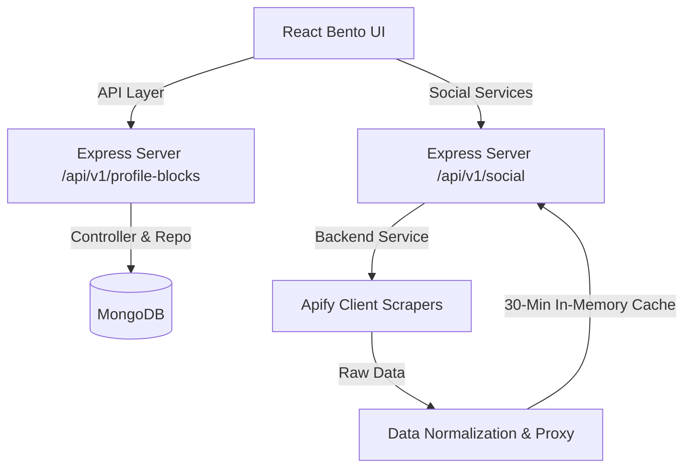

# Production-Grade Bento Profile Builder Implementation Plan

Transform the HiProfile Bento Profile Builder into a scalable, enterprise-grade, database-driven workspace. Eliminate all duplicate/inconsistent layout persistence, enforce single source of truth (`Users`, `Profiles`, `ProfileBlocks`), strictly support the 10 core block types, implement full 4-column dynamic Bento grid with collision detection & automatic compaction, double-click block controls, server-side Apify social data fetching with caching, optimistic UI auto-save, and clean architectural separation (Models, Controllers, Services, API layer).

## Architecture & Data Flow

## User Review Required

> [!IMPORTANT]
> **Single Source of Truth**: All Bento block layout and configuration data will strictly persist in the `ProfileBlock` collection (`userId`, `blockType`, `configuration`, `layout`, `order`, `visibility`). Legacy inline block arrays inside `Profile` or `User` will be completely ignored or removed.

> [!NOTE]
> **Double Click Interaction**: Blocks are rendered clean by default. Only upon **double-clicking** a block will its Top-Left Delete and Top-Right Edit controls appear. Clicking anywhere outside deselects the block.

> [!NOTE]
> **Default Block Dimensions**: All newly created blocks will default to 2 Columns (Width) x 2 Rows (Height) per spec (with allowable custom sizes per block configuration where applicable).

## Open Questions

None at present. Implementation details match the authoritative HiProfile documentation and requirements.

---

## Proposed Changes

### Backend Refactoring & Architecture

#### [MODIFY] [ProfileBlock.js](file:///d:/MERN2/Hi-Profile-main/server/models/ProfileBlock.js)
- Update default height `h` in `layout` to `2` (making default newly created block size 2x2).
- Ensure strict indexing on `{ userId: 1 }`, `{ userId: 1, order: 1 }`, `{ userId: 1, visibility: 1 }`, and `{ userId: 1, blockType: 1 }`.
- Restrict `blockType` enum strictly to 10 types: `['emoji', 'link', 'text', 'checklist', 'image', 'instagram', 'github', 'youtube', 'twitter', 'linkedin']`.

#### [MODIFY] [blockController.js](file:///d:/MERN2/Hi-Profile-main/server/controllers/blockController.js)
- Enforce strict server-side validation per block type:
  - `emoji`: requires `emoji` string.
  - `link`: requires valid `url`.
  - `checklist`: requires `checklist` items array.
  - `github`: requires `username`/`handle`.
  - `image`: requires HTTPS Cloudinary/S3 URL (strictly reject Base64 `data:image/*` dataURIs).
  - `instagram`, `youtube`, `twitter`, `linkedin`: requires valid handle/username.
- Validate ownership (`block.userId == req.user._id`) on all CRUD and layout reorder operations.
- Support debounced/bulk layout update endpoint (`PATCH /api/profile-blocks/reorder`) and single block update (`PUT /api/profile-blocks/:id`, `PATCH /api/profile-blocks/:id`).

#### [MODIFY] [socialRoutes.js](file:///d:/MERN2/Hi-Profile-main/server/routes/socialRoutes.js) & [instagramRoutes.js](file:///d:/MERN2/Hi-Profile-main/server/routes/instagramRoutes.js)
- Unify Instagram scraper under `socialRoutes.js` (`GET /api/social/instagram/:username`) with server-side Apify actor call, 30-minute caching, image proxying, request deduplication, and retry fallbacks.
- Maintain `/api/instagram/profile/:username` as alias route for backwards compatibility.

#### [NEW] [instagramService.js](file:///d:/MERN2/Hi-Profile-main/server/services/instagramService.js)
- Extract Instagram Apify scraping logic into a dedicated backend service module matching the structure of `githubService`, `youtubeService`, `twitterService`, and `linkedinService`.

---

### Frontend API Layer & Grid Utilities

#### [NEW] [bentoGrid.js](file:///d:/MERN2/Hi-Profile-main/client/src/utils/bentoGrid.js)
- Extract grid calculations, collision detection, grid snapping, and automatic vertical compaction (filling empty spaces upward) into a pure, testable utility module.

#### [NEW] [bentoApi.js](file:///d:/MERN2/Hi-Profile-main/client/src/services/bentoApi.js) & [socialApi.js](file:///d:/MERN2/Hi-Profile-main/client/src/services/socialApi.js)
- Modular API service layer to isolate all backend HTTP requests, headers, and error handling away from React component state.

---

### Frontend UI & Interactions

#### [MODIFY] [BentoView.jsx](file:///d:/MERN2/Hi-Profile-main/client/src/pages/BentoView.jsx)
- **Double Click Control Layer**:
  - Implement `selectedBlockId` state.
  - Double clicking a block toggles `selectedBlockId`.
  - Render Delete button on Top-Left (`top: 12`, `left: 12`) and Edit button on Top-Right (`top: 12`, `right: 12`) ONLY when selected.
  - Add click-outside listener to deselect blocks.
- **Resize Handles & Grid**:
  - Render right, bottom, and corner resize handles with appropriate cursors (`ew-resize`, `ns-resize`, `nwse-resize`).
  - Snap resize to 1, 2, 3, 4 columns and 1, 2, 3, 4+ rows.
- **Dynamic Compaction & Repositioning**:
  - Automatically compact empty space upwards when blocks move, shrink, or get deleted.
- **Auto-Save with Optimistic UI & Debounced Persistence**:
  - Instantly update state on drag/resize/edit/delete/create and sync changes to backend. Rollback state if server fails.
- **10 Core Supported Block Types Picker**:
  - Restrict block picker modal to exactly the 10 specified types.
- **Profile Header**:
  - Load profile picture, username, and bio dynamically from MongoDB via `/api/profile-blocks/public/:username` or `/api/profile/me`.

---

## Verification Plan

### Automated Verification
- Run backend syntax and route checks.
- Verify server startup and endpoint availability.
- Test block validation endpoints (e.g. creating image with base64 fails, creating emoji without emoji fails).

### Manual Verification
1. **Grid Drag & Resize**:
   - Drag blocks across the 4-column grid. Confirm snapping, collision resolution, and automatic compaction.
   - Resize blocks using right/bottom handles. Confirm constraint enforcement (1-4 cols, 1-4+ rows).
2. **Double-Click Interaction**:
   - Click a block once -> No controls displayed.
   - Double click a block -> Top Left Delete button and Top Right Edit button appear.
   - Click outside -> Block deselects and controls hide.
3. **Optimistic CRUD & Auto-Save**:
   - Add new block -> Appears immediately, saves to database.
   - Edit block -> Updates immediately, syncs to backend.
   - Delete block -> Disappears immediately, deleted from backend.
4. **Social Widgets**:
   - Verify GitHub, YouTube, Twitter/X, Instagram, and LinkedIn widgets load live data from backend service/Apify with caching.
5. **Public Profile Route**:
   - Access `/:username` -> Renders visible blocks in read-only mode without edit controls or drag/resize functionality.
